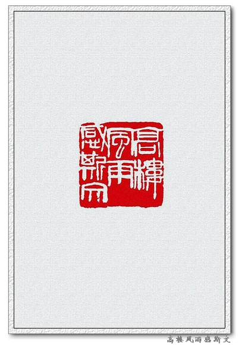
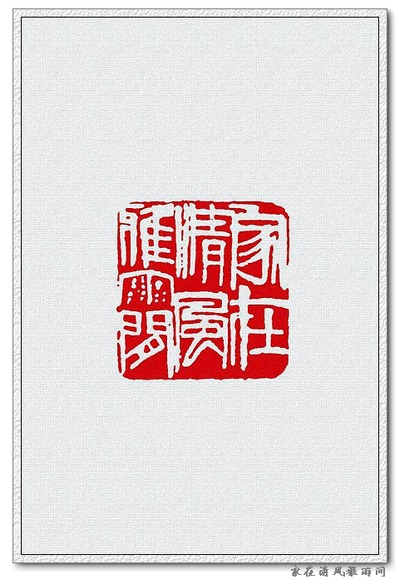

# 齐白石闲章精选
> 齐白石（1863─1957），原名纯芝，字渭青，号兰亭。后改名璜，字濒生，号白石、白石山翁、老萍、饿叟、借山吟馆主者、寄萍堂上老人、三百石印富翁等。湖南湘潭人，近现代中国绘画大师，世界文化名人。早年曾为木工，后以卖画为生，五十七岁后定居北京。擅画花鸟、虫鱼、山水、人物，衰年变法，笔墨雄浑滋润，色彩浓艳明快，造型简练生动，意境淳厚朴实。所作鱼虾虫蟹，天趣横生。其书工篆隶，取法秦汉碑版，行书饶古拙之趣，篆刻自成一家，亦能诗文。曾任中央美术学院名誉教授、中国美术家协会主席等职。

[TOC]

## 二十经沧海

## 墨池清兴

## 杏语馆主

## 霞中厂｜毅斋

## 借山门客

## 百树梨花主人

## 夺得天工

## 吾画遍行天下伪造居多

## 品外｜南皮张氏柳风堂石墨

## 知白守黑｜何要浮名

## 有精神有事业｜吉祥

## 铁夫珍藏

## 白石曾见｜白石门下

## 微风闲坐古松｜简斋

## 寂寞之道

## 高楼风雨感斯文

## 不可居无竹｜不贪为宝

## 前世打钟僧

## 静观｜貌为奇古

## 浮名过实

## 赏画最乐

## 犹有梅花是古人

## 吾心自有乐

## 接木移花手段

## 莲花山下是吾家

## 隔花人远天涯近

## 云盖精舍藏书

## 难如人意一生惭

## 风前月下清吟

## 视道如花

## 乐石室｜乐此不疲

## 吾不丑穷｜闲云野鹤

## 湘潭人也

## 一年容易又秋风｜一夜吹香过石桥

## 鹧鸪啼处百花飞

## 落拓不羁｜清风碧藕楼主人

## 雕虫小技家声

## 杏花春雨江南｜志和藏书

## 翠云长年｜醉白

## 千石印室｜大匠之门

## 太平无事不忘君恩

## 患难见交情

## 天涯亭过客

## 江南布衣

## 叔度读书｜知足胜不祥

## 蒙泉金石文字｜墨缘长寿

## 名花梦里想看  ｜行之苟有恒

## 见贤思齐

## 思安｜秋风红豆

## 连山好竹人家

## 谢氏吉金乐石｜谦则吉恭则寿

## 寄萍堂

## 大器斋

## 一字黔铁

## 流俗之所轻也

## 一息尚存书要读

## 韫山长寿

## 中立不倚

## 西山风日思君

## 淡泊宁静｜清白家风

## 白石篆字｜西山如笑笑我邪

## 白云青霞草堂

## 吟诗一夜东方白

## 雕虫小技家声

## 家在清风雅雨间

## 淡静斋

